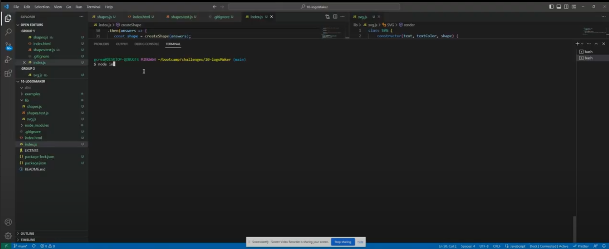

# 10-logomaker

## Description

This app can create a logo for instantly after replying to a few questions

## Installation

Download the files to your computer, then open up the terminal and type the command "npm i" to install jest and inquirer

## Usage

Open the terminal and type "node index" then answer the questions about what shape, shape color, 3 letter text, and text color you want. The logo will be created in the dist folder.

(https://drive.google.com/file/d/1L_BZG1pwfMO6yqLniaZYHk-pGKayNF9V/view?usp=sharing)

## Credits

Grant Creach

## license 
    
  
